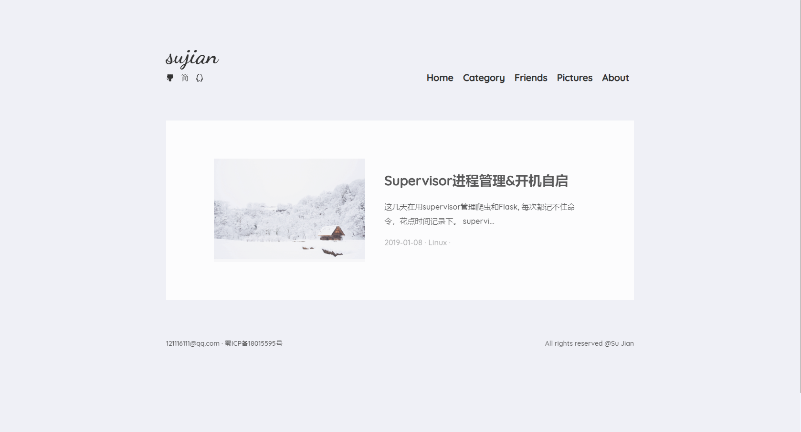
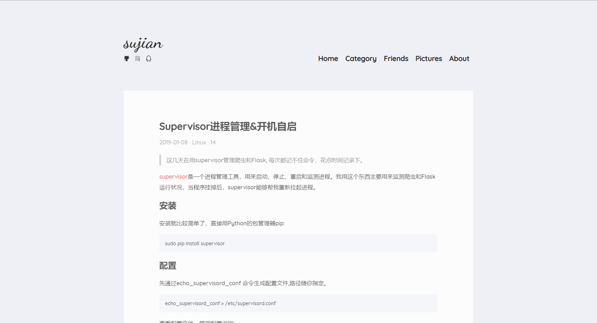
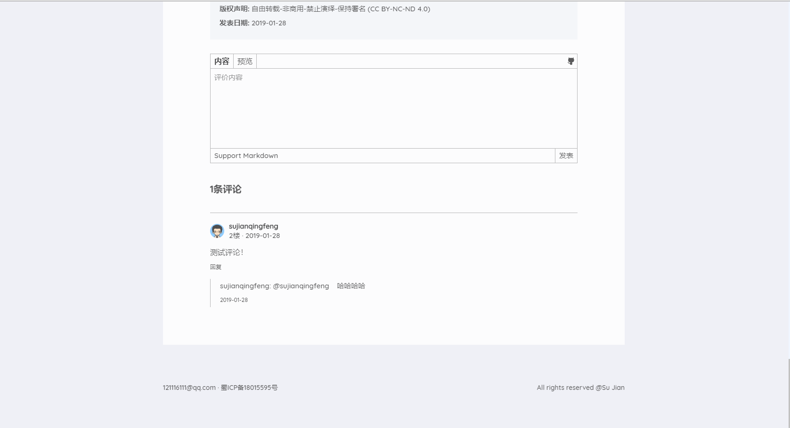

# Vue Simple Blog

用vue实现一个简约的blog前端，blog前端虽然一直在写，但是每一次快写完的时候，都感觉不太好，然后推到重来。这一次就打算不再改了，感觉很简约了。


## 部分截图









## 预览
```
git clone https://github.com/DisasterMeng/Vue-Simple-Blog.git
cd Vue-Simple-Blog
yarn install
yarn serve
```
